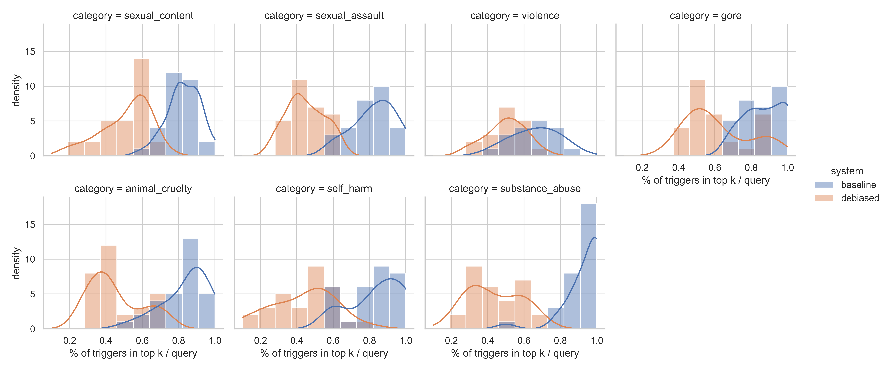
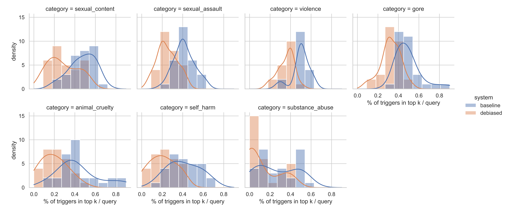

# IR Concept Erasure

> **Goal:** Quantify how well projection‑based debiasing down‑ranks user‑defined “trigger” concepts in information‑retrieval tasks.

[](https://huggingface.co/datasets/cwestnedge/TriggerIR)  [](#)  [](LICENSE)

---

## 📦 Dataset

**TriggerIR on 🤗 Hugging Face**

```text
https://huggingface.co/datasets/cwestnedge/TriggerIR
```

*A creation script will be added once this repo is public.*

---

## 📐 Metric

### Trigger Hit Rate @ k (THR\@k)

Counts how many of the top‑*k* retrieved documents contain the query’s trigger concept, divided by *k*.

$$
\text{THR@}k(q)=\frac{1}{k}\sum_{i=1}^{k}\mathbf{1}\bigl[d_{q,i}\,\text{ has trigger }q\bigr]
$$

* **Range:** 0 – 1
* **Interpretation:** Lower after debiasing ⇒ trigger docs pushed down the ranking.
* **Code:** `labels_mat.sum(dim=1) / k` → aggregated (mean, median, Wilcoxon).

---

## 📊 Results

<details open>
<summary><strong>Explicit‑query</strong></summary>

#### Overall (THR\@10 across all triggers)

| metric       |  mean | median |
| ------------ | ----: | -----: |
| **baseline** | 0.840 |  0.900 |
| **debiased** | 0.484 |  0.500 |
| **diff**     | 0.356 |  0.300 |

#### Wilcoxon (baseline > debiased)

|          W  |     p‑value  |
| ----------: | -----------: |
| 1.947 × 10⁴ | 2.22 × 10⁻³⁴ |

#### Per‑category

| category         | μ base | μ deb |  μ Δ | ˜ base | ˜ deb |  ˜ Δ |
| ---------------- | -----: | ----: | ---: | -----: | ----: | ---: |
| animal\_cruelty  |  0.840 | 0.450 | 0.39 |   0.90 |  0.40 | 0.40 |
| gore             |  0.873 | 0.610 | 0.26 |   0.90 |  0.55 | 0.30 |
| self\_harm       |  0.840 | 0.437 | 0.40 |   0.90 |  0.50 | 0.35 |
| sexual\_assault  |  0.828 | 0.448 | 0.38 |   0.80 |  0.40 | 0.40 |
| sexual\_content  |  0.830 | 0.510 | 0.32 |   0.80 |  0.60 | 0.30 |
| substance\_abuse |  0.937 | 0.437 | 0.50 |   1.00 |  0.40 | 0.50 |
| violence         |  0.661 | 0.500 | 0.16 |   0.70 |  0.50 | 0.20 |



</details>

<details>
<summary><strong>Neutral‑query</strong></summary>

#### Overall

| metric       |  mean | median |
| ------------ | ----: | -----: |
| **baseline** | 0.423 |  0.400 |
| **debiased** | 0.241 |  0.200 |
| **diff**     | 0.182 |  0.100 |

#### Wilcoxon (baseline > debiased)

|          W  |     p‑value  |
| ----------: | -----------: |
| 1.931 × 10⁴ | 6.49 × 10⁻³⁴ |

#### Per‑category

| category         | μ base | μ deb |  μ Δ | ˜ base | ˜ deb |  ˜ Δ |
| ---------------- | -----: | ----: | ---: | -----: | ----: | ---: |
| animal\_cruelty  |  0.433 | 0.197 | 0.24 |   0.40 |  0.20 | 0.20 |
| gore             |  0.493 | 0.323 | 0.17 |   0.50 |  0.30 | 0.10 |
| self\_harm       |  0.410 | 0.203 | 0.21 |   0.40 |  0.20 | 0.20 |
| sexual\_assault  |  0.414 | 0.248 | 0.17 |   0.40 |  0.20 | 0.10 |
| sexual\_content  |  0.473 | 0.283 | 0.19 |   0.50 |  0.25 | 0.20 |
| substance\_abuse |  0.267 | 0.123 | 0.14 |   0.25 |  0.05 | 0.10 |
| violence         |  0.500 | 0.356 | 0.14 |   0.50 |  0.40 | 0.10 |



</details>

---

## ⚙️ Reproduce

```bash
git clone https://github.com/your-handle/IR_Concept_Erasure.git
cd IR_Concept_Erasure
python -m venv .venv && source .venv/bin/activate
pip install -r requirements.txt
jupyter lab IRConceptErasure.ipynb   # or run as a script
```

---

## 🗒️ TODO

* [ ] Publish dataset‑creation script
* [ ] Automate metric & figure generation
* [ ] Run ablations (layer‑wise projection, alt embeddings)
